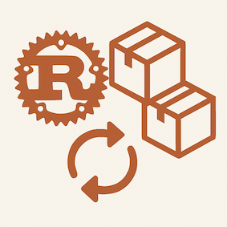

# Async Cargo MCP



<a href="https://github.com/paulirotta/async_cargo_mcp/security/code-scanning">
    
<a>

[](https://github.com/paulirotta/async_cargo_mcp/actions/workflows/rust.yml)
[](https://opensource.org/licenses/MIT)
[](https://opensource.org/license/apache-2-0)
[](https://www.rust-lang.org/)

A Model Context Protocol (MCP) server that enables AI assistants to execute Rust cargo commands safely with asynchronous operation support.

## Overview

This MCP server allows AI assistants to run cargo commands in the background while continuing other tasks. Operations can be executed synchronously or asynchronously, with real-time progress notifications and comprehensive error handling.

## Asynchronous Workflow

This tool enables AI assistants to run cargo commands in the background while continuing other tasks. Operations return immediately with an ID, allowing the AI to proceed with other work and come back later to accept the results when they are availble.

Some AI models take better advantage of this than others. We continue to iterate the tool hints the models see to improve the experience.

### Example: `Claude Sonnet 4`

> **Now let me run the full test suite to verify that all tests pass with my fixes:**
>
> ---
>
> **async_cargo_mcp (MCP Server):**
> > **Perfect! The test is running in the background. While it's running, let me update the `agent-plan.md` to mark this task as substantially complete and document the final findings:**
>
> ```
> agent-plan.md+3-3
> ```

### Example: `GPT-5`

> 
> **I'll run clippy fix, build, nextest, and fmt across the workspace to ensure the changes compile and pass checks.**
>
> ```
> async_cargo_mcp (MCP Server)
> async_cargo_mcp (MCP Server)
> async_cargo_mcp (MCP Server)
> async_cargo_mcp (MCP Server)
> async_cargo_mcp (MCP Server)  
> ⬇️ agent-plan.md <span style="color:green;">+4</span> <span style="color:red;">-5</span>

### Example Gemini 2.5 Pro:

> Now, I'll run cargo build to check for any remaining issues.
> 
> async_cargo_mcp (MCP Server)
> I've addressed the let chain and several polars import errors, including adding imports for col and lit. I am now rebuilding the project to check for any remaining issues.
> 
> async_cargo_mcp (MCP Server)
> 
> After installing `async_cargo_mcp`, you save development time by enabling your LLM to launch background Rust Cargo operations while continuing to think or update planning documents. LLMs can choose synchronous or asynchronous execution. For long-running tasks, asynchronous operations let the LLM proceed with other work while this tool builds and tests in the background. Callbacks are part of the MCP specification. The implementation uses [Anthropic's official `rmcp` Rust SDK](https://github.com/modelcontextprotocol/rust-sdk).

## Supported Commands

### Core Cargo Commands
- **`build`** - Compile the current package
- **`run`** - Build and execute the binary  
- **`test`** - Run the test suite
- **`check`** - Check for compile errors without building
- **`clean`** - Remove build artifacts
- **`doc`** - Build documentation
- **`add`** - Add dependencies to Cargo.toml (updates `Cargo.toml` so synchronous)
- **`remove`** - Remove dependencies from Cargo.toml (synchronous)
- **`update`** - Update dependencies to latest compatible versions (synchronous)
- **`fetch`** - Download dependencies without building
- **`install`** - Install a Rust binary
- **`search`** - Search for packages on crates.io
- **`tree`** - Display dependency tree (synchronous)
- **`version`** - Show cargo version information (synchronous)
- **`rustc`** - Compile with custom rustc options
- **`metadata`** - Output package metadata as JSON (synchronous)

### Extension Commands (if installed)
- **`clippy`** - Enhanced linting and code quality checks
- **`nextest`** - Faster test execution
- **`fmt`** - Code formatting with rustfmt
- **`audit`** - Security vulnerability scanning
- **`upgrade`** - Upgrade dependencies to latest versions (synchronous)
- **`bench`** - Run benchmarks

### Control Commands
- **`wait`** - Wait for async operations to complete (synchronous)

## Features

- **Asynchronous execution** with real-time progress updates
- **Safe operations** with proper working directory isolation
- **Type-safe parameters** with JSON schema validation
- **Operation monitoring** with timeout and cancellation support
- **Comprehensive error handling** and detailed logging

## Installation

```bash
git clone https://github.com/paulirotta/async_cargo_mcp.git
cd async_cargo_mcp
cargo build --release
```

## IDE Integration

### VSCode with GitHub Copilot

Enable MCP in VSCode settings:
```json
{
    "chat.mcp.enabled": true
}
```

Add the server configuration using `Ctrl/Cmd+Shift+P` → "MCP: Add Server":

```json
{
    "servers": {
        "async_cargo_mcp": {
            "type": "stdio",
            "command": "/path/to/async_cargo_mcp/target/release/async_cargo_mcp",
            "args": []
        }
    },
    "inputs": []
}
```

Restart VSCode to activate the server.

## MCP tool usage instructions for AI

Commands support both synchronous and asynchronous execution. For long-running operations, enable async notifications:

```json
{
    "working_directory": "/path/to/project",
    "enable_async_notifications": true
}
```

When async is enabled, use the `wait` command to collect results:
- `wait` with no parameters - wait for all operations
- `wait` with `operation_id` - wait for specific operation
- `wait` with `operation_ids` - wait for multiple operations

## License

Licensed under either [Apache License 2.0](APACHE_LICENSE.txt) or [MIT License](MIT_LICENSE.txt).

## Acknowledgments

Built with [Anthropic's official Rust MCP SDK](https://github.com/modelcontextprotocol/rust-sdk).
